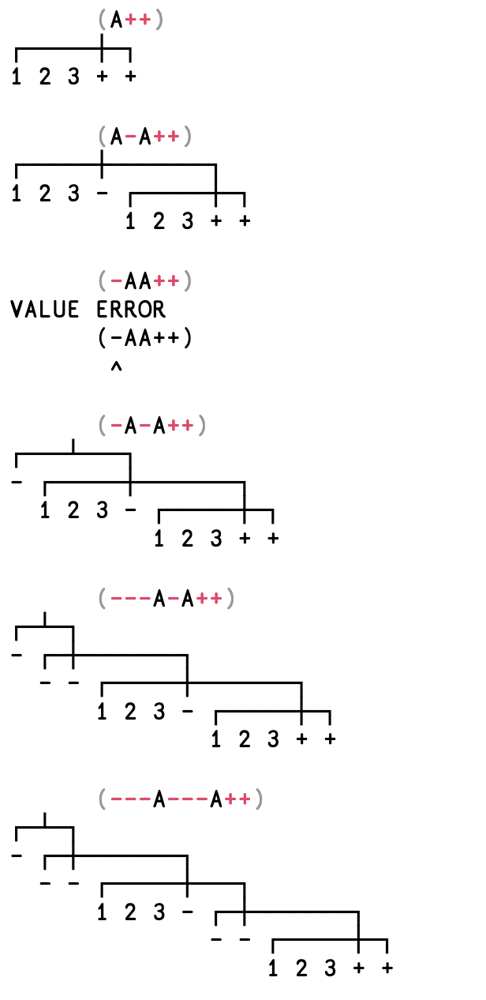

## Bugs

## How To Use This Page

The bugs page is a standing work-in-progress page.

Bugs should be appended - with a section per bug. (if this page is currently empty look at the history of this page in github to see examples of how it is used).

Be sure to mark the ***correct*** results with a `pometo_results` block - if you want to show what `pometo` returns mark that block `apl`.

When a bug is fixed it should be imported into the main documentation - and if appropriate a smoke test should be created.

This document will therefore fill up and empty in the natural progress of things.

***NOTE***: these bug reports should be integrated into the main documentation when they are fixed.

## Goals Of This Page

This is how bug processes normally work on github:

```diagram
  ┌──────────────┐   ┌──────────────┐   ┌──────────────┐   ┌──────────────┐   ┌──────────────┐
  │Raise Issue In│   │ Create A New │   │              │   │              │   │    Update    │
  │    GitHub    │──▶│    Branch    │──▶│ Write A Test │──▶│ Fix The Bug  │──▶│Documentation │
  │              │   │              │   │              │   │              │   │              │
  └──────────────┘   └──────────────┘   └──────────────┘   └──────────────┘   └──────────────┘
```

It involves rework - typically the person fixing it has to master the context and then try and figure out a test that corresponds to it.

We want a shorted, looser process. ***BUGS ARE FIRST AND FOREMOST A DOCUMENTATION, SPECIFICATION AND TESTING PROBLEM.***

Using this page we get two seperate processes with a kanban draw-down style built in:

```diagram
  ┌──────────────┐   ┌──────────────┐
  │  Write Docs  │   │              │
  │  (which is   │──▶│Push to master│
  │    tests)    │   │              │
  └──────────────┘   └──────────────┘


                     ┌──────────────┐   ┌──────────────┐
                     │Pull Bugs from│   │Integrated bug│
                     │     list     │──▶│ fixing into  │
                     │              │   │ normal work  │
                     └──────────────┘   └──────────────┘
```

The bug reporter's job is to:

* identify the bug
* see if it is an isolated case or can it be generalised:
    * the classic model is the OpenBSD approach to stackoverflow bugs
        * people used to fix individual instances of stack overflows
        * OpenBSD audited the entire codebase:
            * built linting tools
            * rewrote the compiler toolchain to load code differently on every occassion
            * build in canaries
            * etc, etc
* write up documentation addressing the issue or issues:
   * state where this documentation needs to be copied over to
* make recommendations about changes to the structure of the documentation

## Forwardslash Operator - Evaluation Order

### The Bug

All the tests are defective becuase they use commutative operators. If a non-commuting operator is used then the order of execution is shown to be arse-backwards:

Consider:

```pometo
÷/ 1 2 3
```

This is:
```pometo_results
1.5
```
and not as you might expect/as we currently return `0.166666667`.

The evaluation order should be `1÷(2÷3)` and not `(1÷2)÷3)`.

### Documentation To Be Updated

This test should be added to this section of the documentation:

https://github.com/gordonguthrie/pometo/blob/master/docs/technical_reference/operators_forwardslash_or_the_reduce_operator.md#gotchas

### Recommendations

* all future operator documentation needs to be checked to make sure it uses non-commuting contructions
* we have a problem with older documentation that has been knocked up ad-hoc - there ought to be a checklist for `function` and `operator` documentation that lists the topics that need to addressed:

For `function`s this looks something like:

* monadic vs dyadic
* scalars vs arrays
* restrictions on input
* error messages that can be omitted

## Arrays Of Functions

### The Bug

Arrays of functions return back to the user and crash the formatter

```apl
"A ← -+÷\n⎕debug A "
```

Causes a bug like:
```erlang
                          [],1,7}
{"init terminating in do_boot",{badarg,[{erlang,'++',[[10|{'$ast¯',{'$func¯',["+"],ambivalent,primitive,explicit,false,none,1,6},[],1,6}],[10|{'$ast¯',{'$func¯',["�"],ambivalent,primitive,explicit,false,none,1,7},[],1,7}]],[]},{lists,append,1,[{file,"lists.erl"},{line,127}]},{string,join,2,[{file,"string.erl"},{line,2244}]},{pometo,'-interpret_TEST2/2-lc$^1/1-1-',1,[{file,"/pomet...
```

Not sure why - but there are issues around how it should print...

Was trying to get a display of the structure of trains like this from dyalog:



### Documentation To Be Updated

I would say a proper implementation of this needs to be added to the function/page stdlib_debug_function and also then it should be used in the page trains to explain how the functions are allocated
