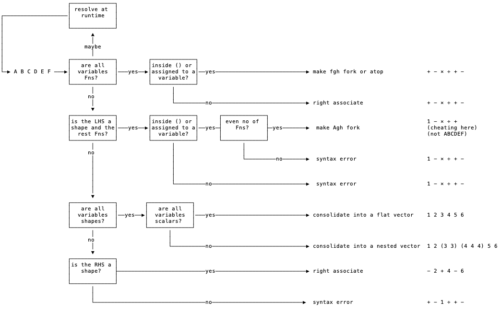
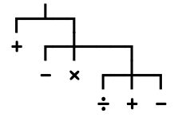
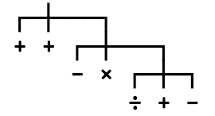

# Notes On The Implementation Of The Parser

A TRADFN is:

* a declaration
		* ∇
		* name
		* statement model
* a set of statements
* an ending
		* ∇

 A statement model is one of these options:

***Defined Functions***

| Result     |Niladic   |Monadic    |Dyadic     | Ambivalent  |
|------------|----------|-----------|-----------|-------------|
| None 	     | f 	      | f Y       |	X f Y 	  | {X} f Y     |
| Explicit 	 | R←f 	    | R←f Y     |	R←X f Y   | R←{X} f Y   |
| Suppressed | {R}←f    | {R}←f Y   | {R}←X f Y | {R}←{X} f Y |

An Ambivalent Function is one that might be Monadic or Dyadic depending on context (eg `+` is Ambivalent)

***Derived Functions*** produced by Monadic Operator:

| Result     | Monadic     | Dyadic       | Ambivalent     |
|------------|-------------|--------------|----------------|
| None       | (A op)Y     | X(A op)Y     | {X}(A op)Y     |
| Explicit   | R←(A op)Y   | R←X(A op)Y   | R←{X}(A op)Y   |
| Suppressed | {R}←(A op)Y | {R}←X(A op)Y | {R}←{X}(A op)Y |

***Derived Functions*** produced by Dyadic Operator:

| Result     | Monadic       | Dyadic         | Ambivalent       |
|------------|---------------|----------------|------------------|
| None       | (A op B)Y     | X(A op B)Y     | {X}(A op B)Y     |
| Explicit   | R←(A op B)Y   | R←X(A op B)Y   | R←{X}(A op B)Y   |
| Suppressed | {R}←(A op B)Y | {R}←X(A op B)Y | {R}←{X}(A op B)Y |


## Trains etc

```apl
 (f g h)⍵ ←→ (  f ⍵) g (  h ⍵)   ⍝ monadic fork (or monadic fgh fork)
 (A g h)⍵ ←→    A    g (  h ⍵)   ⍝ monadic fork (or monadic Agh fork)
 (  g h)⍵ ←→         g (  h ⍵)   ⍝ monadic atop

⍺(f g h)⍵ ←→ (⍺ f ⍵) g (⍺ h ⍵)   ⍝ dyadic fork (or dyadic fgh fork)
⍺(A g h)⍵ ←→    A    g (⍺ h ⍵)   ⍝ dyadic fork (or dyadic Agh fork)
⍺(  g h)⍵ ←→         g (⍺ h ⍵)   ⍝ dyadic atop
```

## Runtime Evaluation

Expressions of the form:

```pometo
1 +
```

Are always syntax errors

```pometo_results
Error
1 +
--^
SYNTAX ERROR (syntax error before: :) on line 1 at character 3
```

This is true if the value is replaced with a variable

```pometo
A ← 1
A +
```

```pometo_results
Error
A ← 1
A +
--^
SYNTAX ERROR (invalid expression:no value at the RHS) on line 2 at character 3
```

This feeds into all evaluations.



### Case 1

Sometimes we can't tell if a thing is a train or not:

```pometo
H ← ×
A ← + - H ÷ + -
A 10
```

gives

```pometo_results
99.0
```

This resolves to an execution tree of:



Change `H` to a scalar:

```pometo
H ← 1
A ← + - H ÷ + -
```

gives

```pometo_results
Syntax error
```


### Case 2

If the variable switches to a function we get:

```pometo
H ← +
A ← + - × ÷ + -
A 10
```

gives

```pometo_results
1
```





The third case `+ - × ÷ + -` we know it is might be a train because it is assigned to a variable - so an array of type `func` or `maybe_func` is created and then passed at runtime to `pometo_runtime:maybe_run_monadic_train`

### Case 3

Now move the variable to the start of the


## Trains, Right Associate Funcs, Runtime Evaluation

Trains bring us problems.

We can chain things into random vectors:

```pometo
A ← 1
B ← 3
A B
```

Scalars resolve to vectors:

```pometo_results
1 3
```

This extends obviously:

```pometo
A ← 1
B ← 3
A B A B A
```

giving:

```pometo_results
1 3 1 3 1
```

Vectors resolve to a vector of vectors:

```pometo
A ← 1 2
B ← 3 4
A B A
```

Scalars resolve to vectors:

```pometo_results
┌───┐ ┌───┐ ┌───┐
│1 2│ │3 4│ │1 2│
└───┘ └───┘ └───┘
```

Things start getting messier when we mix in actual numbers into the expression. We don't know at write time if this will resolve as functions operating monadically on 4 5 or some data structure. We only know that ***after*** we have resolved the expressions that give values for `A` and `B`:

```pometo
A ← 1 2
B ← 3 4
A B A 4 5
```

Which is an array:

```pometo_results
┌───┐ ┌───┐ ┌───┐ ┌───┐
│1 2│ │3 4│ │1 2│ │4 5│
└───┘ └───┘ └───┘ └───┘
```

But if A was a function:

```pometo
A ← -
B ← 3 4
A B A 4 5
```

This is the equivalent of:

```apl
- 3 4 - 4 5
```

It evaluates as:

```pometo_results
1 1
```

The execution sequence is:

| Function | Sign | Type    | LHS Argument  | RHS Argument    | Result          |
|----------|------|---------|---------------|-----------------|-----------------|
|minus     | `-`  | dyadic  | `array` [3 4] | `array` [ 4  5] | `array` [¯1 ¯1] |
|minus     | `+`  | monadic |               | `array` [¯1 ¯1] | `array` [ 1  1] |

For sufficiently complex stuff the bottom line cannot be evaluated until run time:

```pometo
A ← 1
B ← 2
C ← 3
A B C 4
```

```pometo_results
1 2 3 4
```

But...

```pometo
A ← +
B ← ÷
C ← -
A B C 4
```

```pometo_results
¯0.25
```

And...

```pometo
A ← 2
B ← ÷
C ← -
A B C 4
```

```pometo_results
¯0.5
```

This goes for trains of trains

```pometo
-+÷-+÷10
```

Giving:

```pometo_results
10
```

But

```pometo
F ← -+÷
-+÷F 10
```

Resulting in:

```pometo_results
0.101010101
```

