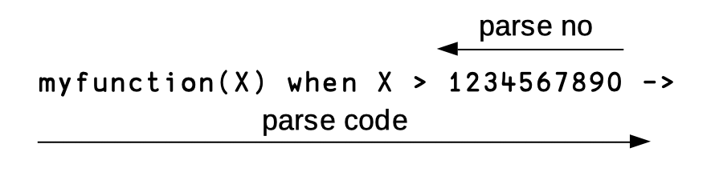
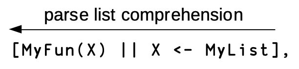
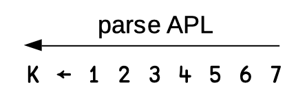
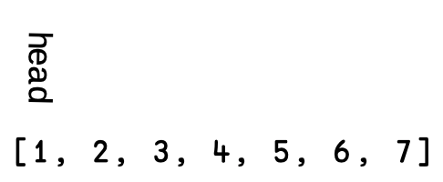
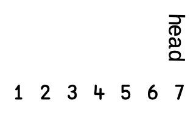

# Design Docs for Pometo

## Introduction

These are design docs for Pometo

They are a work in progress - and are not definitive

## Purpose

To dump what I think I need to do down and get my arms around the work

## Scope

The scope of these documents are:

* developer flow
    * how you write APL in Pometo
* testing
    * writing end to end tests
    * embedding testing in documents
* the compiler toolchain
    * lexer
    * parser
    * output as `Liffey`
         * `Liffey` is a `LISP` `AST` defined as having a `to_string()` correspondence to `LFE` (`Lisp Flavoured Erlang`)
    * the REPL, `rappel`
* technical design decision
     * lazy evaluation of ⍴ ie accept lists as vectors)
          * requires a reserved `atom` - suggested `¯¯POMETO¯¯`
     * eager evaluation creates `map` data structures with integers as keys for fast lookup
     * the compiler deduces when to convert from lazy to eager and inserts a conversion step (if needed)
     * external calling functions to create data structures come in two flavours
         * `eager` and `lazy`

## Developer Flow

We need a shell, but how to represent it? We also need a virtual keyboard for onboarding.

A web-GUI makes sense then with an HTTP interface to a REPL - `rappel` is a cool name ;-)

## Overview

The basic kick off document is here:

https://medium.com/@gordonguthrie/the-beam-needs-an-apl-y-language-6c5c998ba6d

## Rowan's thoughts 2020_05_04

Heres an assortment of APL functions if you need testing targets.
I tried to pick ones ranging from simple (mean) to deviously complex (trav).
These were written for gnu apl, but nowadays dyalog is the most prominent implementation. There are subtle differences between the two I can help explain, or point you in the right direction for help.

I have written them in the DFN style (see https://en.wikipedia.org/wiki/Direct_function). There is also tradfns (https://aplwiki.com/wiki/Tradfn).

Gordon sed:
```quote
We will have both TradFns and DFNs - TradFns will correspond to Erlang and Elixir Fns and will be contained in modules (like Erlang Elixir) they will be declared private and public (like etc, etc).

The scope of TradFns will be function level (ie no global variables). DFNs will be closures over immutable values (like Funs in Erlang/Elixir).

I also intend that Pometo fns will be pure functions and side effect free so they will have to ability to call out to other languages or read data from external state.

The REPL in rappel will therefore be different to other APL REPLs.

It can be thought of as an Erlang function that calls out to Pometo ones.

You will be able to declare variables and bind them to the result of arbritary {module, function, argument} evals in Erlang/Elixir and then invoke your Pometo fns with those variables.

Rappel will be implemented in a gen server and the persistence of that gen servers state to the Binary Erlang Term Format means you will be able to persist and hydrate sessions, and email them to people.

We could potentially dump them to other formats that are more git friendly, lets see.

```

I am also asking people who have written FOSS implementations in the APL family about what weaknesses and possible changes they interpret in the language. I will compile these and fwd them.

```apl
mean ← {(⍴⍵)÷⍨+/⍵}
gmean ← {(÷⍴⍵)*⍨×/⍵} ⍝ geometric mean
hmean ← {÷(⍴⍵)÷⍨+/÷⍵} ⍝ harmonic mean
stdev ← { {0.5*⍨mean ⍵} {2*⍨⍵-⍨mean ⍵} ⍵ }
skew ← {+/(⍺*⍨⍵-mean ⍵)÷(⍴⍵)×⍺*⍨stdev ⍵} ⍝ ⍺ ← 3 → skew ◊ ⍺ ← 4 → kurtosis
phi ← { {1+÷⍵}⍣≡1⊣⍵}
eul ← {(÷2) *⍨ +/2*⍨⍵} ⍝ euclidian norm
comb ← { ⍵ {((⊂⍳⍺)×⍵)~¨0} ⍺ {⊂[1](⍺=+⌿⍵)/⍵} {(⍵⍴2)⊤⍳2*⍵} ⍵} ⍝ combinatorial. 3 comb 5
freq ← {(∪⍵){⍺,[÷2]+/⍺∘.=⍵}⍵} ⍝ frequency of numbers

sigmoid ← {÷1+*-⍵}
sigmoid_grad ← {⍵ × (1 - ⍵)}

⍝ box muller distribution. ⍺→depth ◊ ⍵→number of elements
⍝ Does not include setting the RNG seed!
gauss ← { {((¯2×⍟1⊃⍵)*0.5)×1○○2×2⊃⍵} ⍺ {⊂[1+⍳⍴,⍵](?(2,⍵)⍴⍺)÷⍺} ⍵}

⍝ higher order functions and rank operations:
hof ← {(⍶⍤1) ⍵}
diff ← { {∈{(1↑⍵)-⍨¯1↑⍵}¨2,/⍵} hof ⍵ } ⍝ convert a cumulative tally to an integer difference
⍝ diff ⍉10 10 ⍴ ⍳100 ⍝ difference down each column

⍝ traversal
⍝ see: https://dfns.dyalog.com/n_trav.htm
⍝      t         trav visits: t r a v
⍝    ┌─┼─┐       ravt visits: r a v t
⍝    r a v
trav ← {⊃(⍶ {⍺(⍶ trav ⍹)⍵} ⍹)⍨/⌽(⊂⍺ ⍶ ⍵),⍺ ⍹ ⍵} ⍝ dfs
gcd ← {⍺ | trav {⍺~0} ⍵} ⍝ gcd algorithm example
```


## Rowan's thoughts 2020_05_12

I was thinking of language details that have far-reaching consequences:
1. The Workspace
2. Scoping

Traditionally, APL has the concept of a "workspace" - a serializable program state that can be persisted to disk and resumed at a later point. It is useful in many data science workflows (as well as timesharing mainframes) - import some data, perform some analysis, write some functions, pick it up at a later point. More recent APL-family languages have left it out (specifically K - see note below), as it increases complexity (K is notoriously spartan in its aesthetic). It also has some impedance with modern VCS, as it historically was kept in an implementation specific binary format. I am unsure how well the concept of the workspace matches with erlang/BEAM. I am agnostic about its inclusion, but its something to keep in mind as you flesh out the language and the repl.

Note: I believe K uses a hierarchical global dictionary dubbed the K-Tree.
http://microapl.com/APL/apl_concepts_chapter2.html

Traditionally, APL globally scopes variables (egads!). In tradfn definitions, you would append the variable with a semicolon to locally scope. For example:

∇Z ← FOO A ;b ⍝ b is a local variable
    b←A+1
    Z←b
∇

I believe Dyalog locally scopes variables by default in DFN's (can confirm later). For example:
{b←⍵+1 ⋄ b} ⍝ b is locally scoped
I am also unsure if the scoping persists to nested lambdas within lambdas, ie:
{ b←⍵+1 ⋄ {b←⍵+2 ⋄ b} b} ⍝ does mutating the innermost b affect the outermost b?

I will have to start dyalog and run tests to check behavior.
Gnu APL on the other hand adopted a lambda style (and local variable definition) much closer in behavior to tradfns.
This is likely due to Jurgen's desire to match the Spec and keep implementation specific complexity at a minimum (he has spoken in great length about this in various emails to the mailing list).

⍝ gnu apl lambdas
{b⊣b←⍵+1;b} ⍝ b is local.
gnu APL uses ⊣ within lambdas as a quasi statement separator, and does not allow ⋄ or guards.

Personally, I prefer local-by-default, even if it will make the language "apl-ish" vs "mostly apl". However I am not the one writing the language, so I cede to your judgement.

There are other additional concepts I've had on my mind, like tacit functions, implicit function trains, and guards, but I don't think they are as important decisions as workspaces & scoping.

Very interested in how you envision the REPL. On one hand I prefer this:
1> ⍳3
      1 2 3

to this:
1> apl:stmt("⍳3");

but I also understand that accomplishing your goals with as little code/complexity as possible is important, and handling everything that the beam is capable of is not feasible. Is it possible to have a sub-repl? - start in erlang, switch to apl, write a function, return to erlang.

## Gordon's Working Notes 2020_05_13

`rappel` is now up as a repo with a proper README for getting started.
I have some very basic APL running, yay!

Basically:

```apl
1.1 2.2 + 3.3 4.4
1.1 2.2 ¯ 3.3 4.4
1.1 2.2 × 3.3 4.4
1.1 2.2 ÷ 3.3 4.4
```

The focus is next on getting the continuous integration and testing up.
What I want to do is smash three things into one:

* writing the specification
* writing the user manual
* writing the test suite

I am going to use markdown as the documentation of the language and parse that markdown for code blocks in `pometo` and have a test runner that executes them.

The idea is that you first write out what the feature should do in the documentation with the basic test cases (the user manual) and some edge case tests (the reference manual) and then these will fail in the test suite because you haven't implemented the features.
As we add the features, the tests should start passing and when they do, we commit to master.

This way reduces work dramatically ;-)

Rather than explain the toolchain I will demo it.

## Gordon's working notes on `rho`/shape 2020/05/18

We have a number of approaches to manage `rho`/shape, particularly in light of passing in data in native `Erlang`/`Elixir` data structures.

There are two core aspects - which can be combined.

The first is eager/lazy

* an eager data structure knows it shape up front
* a lazy data structure is just a list (or a structure binary) of undefined length

When shape-dependent actions are taken on eager data structures the shape is checked before execution (this is only partial tho - if the top-level shape is 2 2 and the third element is a shape then that shape will only be checked at run-time.

When shape-dependent actions are taken on lazy data structures the shape is implicitly checked by the runtime.

We can see that in the runtime function that executes dyadics of the same shape:

```erlang
zip([], [], _, Acc) -> lists:reverse(Acc);
zip([H1 | T1], [H2 | T2], Fn, Acc) ->
	NewAcc = execute_dyadic(Fn, H1, H2),
	zip(T1, T2, Fn, [NewAcc | Acc]).
```

The terminal clause has an implicit assumption that the lazy lists being consumed in the 2nd clause have the same length.

(by default any lazy data structure can be made eager on the first traverse, this needs to be baked in, but isn't currently.)

The second is indexed/not-indexed.

A lot of operations don't require knowledge of indexing.

In these cases the core vals are stored in the `#'¯¯⍴¯¯'%{}` record as lists (or a structured binary).

If indexing is required the list needs to be converted into an indexed map so that:

```erlang
[1.1, 2.2, 3.3]
```

becomes
```erlang
%{1 => 1.1, 2 => 2.2, 3 => 3.3}
```

Again the compiler knows when this has to be done, and needs to insert the conversion.

The basic performance premise of `Pometo` is that you bring the data to the programme - `Pometo` code only runs inside a `BEAM` process - all the `list` and `map` data structures are on the process heap and GC happens in-process.

This gives you a naturally horizontally scaling architectures.

The downside of this is that if you distribute data around between processes you have to send a message with a complete copy of that data structure - which can be expensive - in pipeline processing this might be problematic.

There is another non-indexed, lazy data primitive - the structured binary.

In this the data is stored in a format like a C struct - a type/length indicator and then a binary, and you walk down the binary snipping off and converting bits of data:

```erlang
...
<<Type:16/little-unsigned-integer,Length:16/little-unsigned-integer, Rest>> = Bin,
<<RawData:16* Length/binary, Rest2>> = Rest,
Data = convert(Type, RawData),
...
```

Structured binary data has the characteristics that it is stored in a global heap and can be passed between processes using a pointer.

The global head is reference counted and when processes that hold a reference are GCed they, if the pointer is out of scope, delete the reference. When it hits 0 the binary is deallocated.

Because the `BEAM` uses immutable data structures this also means that any variables that are pattern-matched out of the binary are also pointers and not allocated on the process heap.

If any fragment in any process is stored in state, then the whole binary will not be GCed.

This can be tricky to manage - so structured binary data is slightly more difficult.

We can manage this at an interface level.

`Pometo` code will be arranged in modules with private and public functions (like other `BEAM` languages) and we can decorate function export, so we can declare functions as:

* public (lazy, accepts data in lists)
* eager (only accepts dataconverted into `#'¯¯⍴¯¯'{}` using an exported conversion function)
* binary (accepts lists converted into structured data, again using a conversion function)

The compiler then needs to put a shim between the function definition and the declared code to enfore this.

## Gordon's working notes on AST 2020/05/19

### Background

The Data Structure in the compiler is a guddle - it has become a `yasl` (Yet Another Shitty Lisp) - and needs to be made a realer `lisp` - a proper data structure that can unambigously be traversed in a homegenous fashion.

At the moment the records are congested:

This is how expressions like `1 2 + 3 4` are stored:
```erlang
-record(expr, {
    type,
    expression,
    application,      % [monadic | dyadic]
    fn_name,
    args         = []
  }).
```

and this is a `let`

```erlang
-record(let_op, {
     var,
     expression,
     vals
  }).
```

We need to have a unifying `ast` record that represents a realer `lisp` and it needs to support a common set of actions:

* it is executable recursively
* we can reconstruct the source expression by traversing it
* we can rewrite it
* branch nodes are operators
* leaf nodes are one of:
   * constant
   * variable
   * `⋄` statement seperator
   * `⍝` comment

### Proposed New Structure

Top level record:

```erlang
-record(ast, {
          op,     [dyadic_+, monadic_+, dyadic_-, monadic_-, ←       etc, etc],
etc, etc],
          args,   []
    }).
```

Special operators:

* `rho` contains multitudes - unlike other operators `rho` is key at execution time
* brackets need to be transformed into an operator

### Source Code Mapping

There is now (commented out normally) a line in `pometo_compiler` that prints out the intermediate Erlang source code for the module under compilation.

At the moment it is only for compiled modules for compiler testing (pending adding functions to the `Pometo` language). The module structure looks like this:

```erlang
-module(basic_compiler_test_module).

-export([run/0]).

-record(liffey,
  {op, args = [], line_no = none, char_no = none}).

-record('¯¯⍴¯¯',
  {style = eager, indexed = false, dimensions = [],
   line_no = none, char_no = none}).

run() ->
    do_run_3d224d14a05bc38e76541a3a3b0b6bf35b86abab().

do_run_3d224d14a05bc38e76541a3a3b0b6bf35b86abab() ->
    A = [4, 5, 6],
    B = [6, 7, -8],
    pometo_runtime:dyadic(["+",
         #liffey{op =
               #'¯¯⍴¯¯'{style = eager, indexed = false,
            dimensions = [1], line_no = 2,
            char_no = 1},
           args = A, line_no = none, char_no = none},
         #liffey{op =
               #'¯¯⍴¯¯'{style = eager, indexed = false,
            dimensions = [1], line_no = 2,
            char_no = 5},
           args = B, line_no = none, char_no = none}]).
```

In addition a source module data structure is built up:

```erlang
#{1 => {sourcemap,none,none,"module attribute"},
  2 => {sourcemap,none,none,"export attribute"},
  3 => {sourcemap,none,none,"parser records import definition"},
  5 => {sourcemap,none,none,"public declaration of run/0"},
  6 => {sourcemap,1,1,"let"},
  7 => {sourcemap,1,13,"let"},
  8 => {sourcemap,2,3,"dyadic_+"}}
```

In the final state the exposed function (here `run`) will contain a `try`/`catch` pair and any runtime errors will be caught. There will be an internal function constructured from the `sourcemap` data and run time errors will be reformatted to express that error in terms of the `line_no`/`character_no` of the original source code.

As the characteristics of `Pometo` functions are better defined in the language the exported function wrapping the `do_` function may or may not be decorated with functions that cast lists into internal `Pometo` data structures before invoking the `do_` and back again after.

### Getting down and dirty with the real nitty gritty lolol 2020/06/15

#### Compiler rewrite

Driven and informed by this https://dl.acm.org/doi/abs/10.1145/3386319

The developmenal approach needs to slow down and be more considered. First up I know understand the difference between `operators` and `functions`. We need to systematically implmement the following `operators`:

* `reduce`
* `reduce last`
* `scan`
* `scan last`
* `inner product`
* `outer product`
* `axis`

Consideration of these immediately surfaces a strategic problem pertaining to interoperability.

`Erlang` and `Elixir` and most programming languages) have a mixed latin-arabic parse direction whereas APL is traditionally pure arabic.

```bollocks
  ____        _ _            _
 |  _ \      | | |          | |
 | |_) | ___ | | | ___   ___| | _____
 |  _ < / _ \| | |/ _ \ / __| |/ / __|
 | |_) | (_) | | | (_) | (__|   <\__ \
 |____/ \___/|_|_|\___/ \___|_|\_\___/

```

***this is just bollocks tho because APL retains latin parsing for charlists - its left to right - foldr's can't be avoided the problem is determining if trains, atops and dfuns are commutative or not. For functions like `+` and `×` a foldl can be swapped for a foldr - for `-` and `÷` a foldr is needed. How does that generalise?***

This arises from the simple insertion of Arabic numbers into latin scripts:



This accounts for the problem that some developers when presented with list comprehensions which are notationally arabic:



By comparison of course `APL` is a purely arabic language:



The consequence of this is that conceptually `Erlang` `lists` and `APL` `arrays` are reversed:

In `Erlang`:



but in `APL`:



At the moment `Pometo` `array`s are implemented with latin parsing - which if maintained would imply that all `Pometo` `operator`s are implemented as `foldr`'s and not `foldl`'s. This is not good. (The overhead in full link-list scans alone would be horrendous).

We need to embrace the notational conciseness of `APL` and point out to converting `Erlang` developers that notationally their `lists` are reversed.

The fix is fairly simple - accumulate at the head not the tail in `parser_include.hrl` but it does mean that in debugging the arrays will appear reversed.

But from a `Pometo` developer's perspective any dumped data structures willl be shown in error logs reversed.


#### Array's And Data Types

`Pometo` will support nested arrays and strand notation.

Array's will be typed with the following type:
 * current types are:
    * `number`
      * integers
      * floats
      * complex numbers
    * `boolean`
      * `boolean` arrays are typed on the numbers `1` and `0` and cast to `numbers` on accumulation
    * `array`
    * `mixed`
* future types will be:
    * `charlists`
    * `bitstrings`
    * `bitbools`
* there will also be leaf-arrays - array-types that cannot contain other arrays, these will be based on existing `Erlang`/`Elixir` data types:
    * `tuples`
    * `records`
    * `fixedmaps` - these are `Erlang` `maps` with the immutability of structure of `Elixir` `structs`
    * maybe `ordsets` and `orddicts` (can be thought of as sparse arrays - and/or we might implmenent spares arrays in them).

Leaf-arrays will be addressable with index notation if they are tuples and key notation if they are maps or records.

There will be built in functions to declare the non-numeric/charlist types

Array representations can be:

* indexed
* unindexed

An unindexed array is represented by a list - an indexed one by a map with numerical keys. Typically we would expect `Erlang` or `Elixir` programmes to pass in unindexed arrays and the compiler knows when indexing is required and the runtime will ensure that datasets are converted when appropriate. This can be done 'in passing' if necessary.

Array's can also be:

* eager
* lazy

A lazy array representation is one in which it doesn't know its shape - it is a vector of indeterminate length - again any pass over a lazy array might convert it to an eager one.

## Using Indices And Counts To Implement Reduction

Trying to design algos for arbritrary matrix ops ***on the fly*** against pre-written tests has proved to be painful and inefficient.

What has proven to work is using handwritten stepwise execution plans.

This is one such for diadic reduction. Normally one writes from the simple to the complex, but for matrix ops it turns out that this just involves rewritting and rewritting and rewritting - so in this instance we treat the ***simple*** as degenerate cases of the ***normal***

```apl
A ← ⍳ 24
B ← 2 3 4 ⍴ A
n2 +/[2] B
```

B is:

```apl
 1  2  3  4
 5  6  7  8
 9 10 11 12

13 14 15 16
17 18 19 20
21 22 23 24
```

The result should be:

```apl
 6  8 10 12
14 16 18 20

30 32 34 36
38 40 42 44
```

or:

```apl
(1 + 5) (2 +  6) (3 +  7) (4 +  8)
(5 + 9) (6 + 10) (7 + 11) (8 + 12)

(13 + 17) (14 + 18) (15 + 19) (16 + 20)
(17 + 21) (18 + 22) (19 + 23) (20 + 24)
```


We represent the count as:

`{1, 1, 1}` where the positions correspond to the axis `[2 3 4]` so we are counting arabic style right-to-left.

So as we iterate. The counts are different - based on different axes.

```bollocks
Old Count                          New Count
---------                          ---------
{1, 1, 1} -> needs to be pushed to {1, 1, 1} -> 1
                                   {1, 0, 1} -> supressed
{1, 1, 2} -> needs to be pushed to {1, 1, 2} -> 2
                                   {1, 0, 2} -> supressed
...
{1, 2, 1} -> needs to be pushed to {1, 1, 1} -> 1 + 5 -> 6
                                   {1, 2, 1} -> 5
...
{1, 3, 1} -> needs to be pushed to {1, 1, 1} -> 1 + 5 -> 6
                                   {1, 2, 1} -> 5
...
{2, 1, 1} -> needs to be pushed to {2, 1, 1} -> 13
                                   {2, 0, 1} -> supressed
{2, 1, 2} -> needs to be pushed to {2, 1, 2} -> 14
                                   {2, 0, 2} -> supressed
...
{2, 2, 1} -> needs to be pushed to {2, 2, 1} -> 18
                                   {2, 1, 1} -> 13 + 17 -> 30
```
The supression criteria is the count being `=< 0` in the shifted rank.

Summary:

* we do a single sweep of the matrix in order (so can be a list or an index map)
* we calculate the location of the data point in the new world (so it must be an index map)
* we make the operation which can be:
   * EITHER an initialisation (the key is non-existant in the index map)
   * OR a dyadic operation - the existing value on the left, the new value on the right