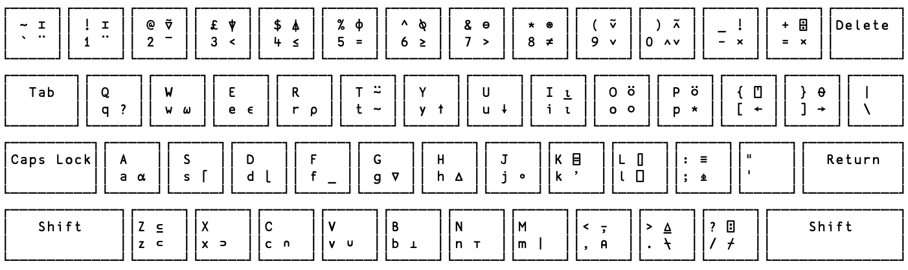
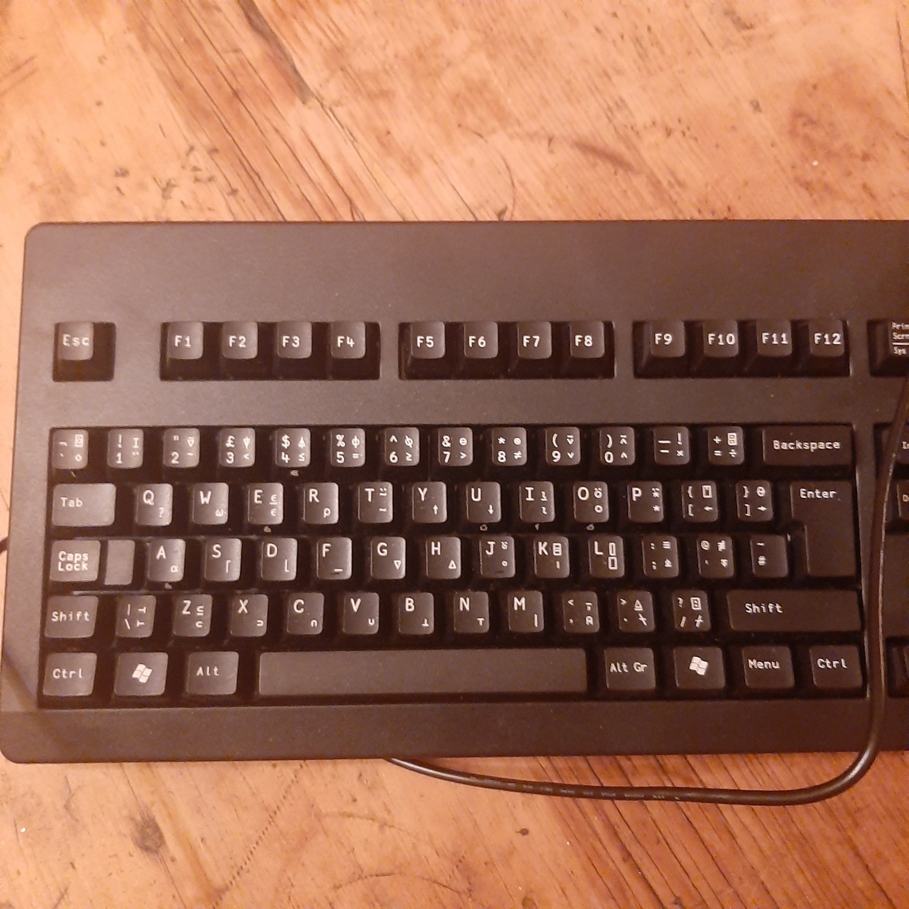
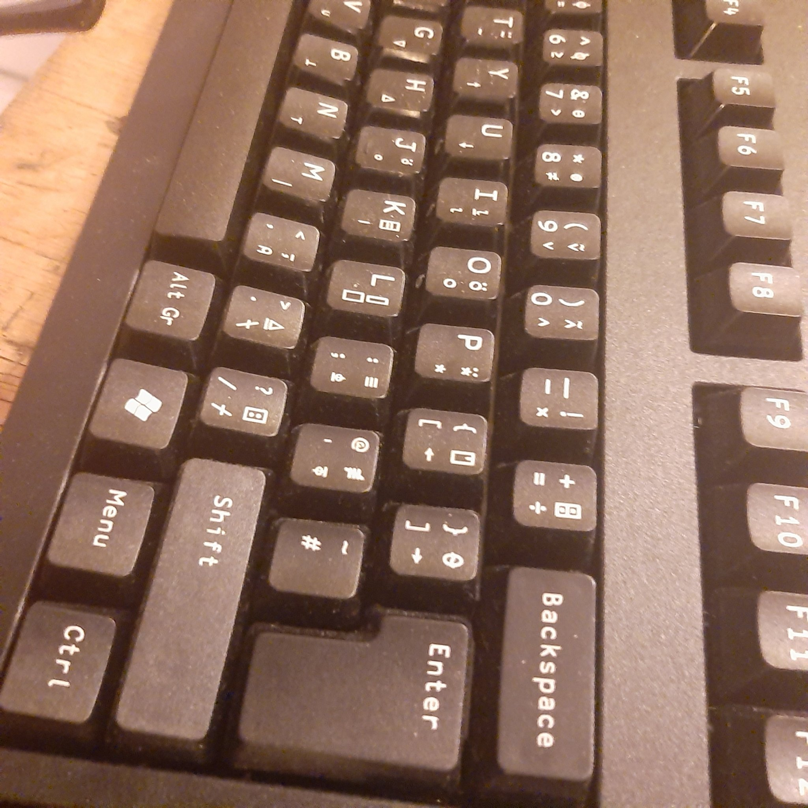

# Eek, How Do I Even Type This?

That great panic, right? Its easy. You need to install an `apl` font and a keyboard layout:

The font is ***Apl385 Unicode*** which you need to install on your dev machine You should also install an APL keyboard on your dev machine. Download and installation instructions are [available on the Dyalog apl font and keyboards page](https://www.dyalog.com/apl-font-keyboard.htm). 

If you are a Mac user just print out this cheat sheet and away you go:

If you are a windows user, lets talk and I will add a cheat sheet for you.

Writing programmes in `apl` is very iterative, using the `repl` `Rappel` - which has its own in-browser keyboard.

If you are hardcore, you can even [buy a special APL keyboard](https://www.dyalog.com/apl-font-keyboard.htm) and be the envy of your pals ;-)

