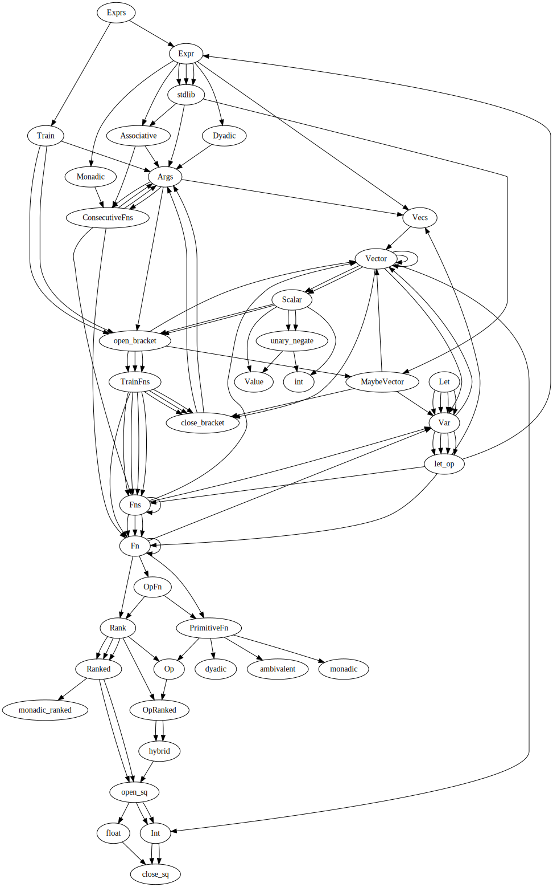

## Lexer/Parser Development


The lexer is `leex` and the parser is `yecc` - these are Erlang implementations of the old `C` `lex` and `yacc` programmes.

Documentation, such as it is, is online:

* [leex](https://erlang.org/doc/man/leex.html)
* [yecc](https://erlang.org/doc/man/yecc.html)

Debugging and developing with parsers is somewhat of a black art.

The parser is instrumented and will dump out all the function calls that operate on the AST at runtime. This is triggered by a check on the Environment variable `DBGPARSER`.

For instance running the `runner` module for development via the batch file:

```
DBGPARSER=true ./run.sh
```

will dump out parser information like so:

```
*************************
in parser include function handle_value/2 (func head: 2)
argument: sign: positive
argument: ast: {'$ast¯',{'$shape¯',false,0,none,number,1,28},7,1,28}
*************************

*************************
in parser include function append_to_vector/2 (func head: 2)
argument: lhs: {'$ast¯',{'$shape¯',false,0,none,number,1,26},6,1,26}
argument: rhs: {'$ast¯',{'$shape¯',false,0,none,number,1,28},7,1,28}
*************************

*************************
in parser include function finalise_vector/1 (func head: 3)
argument: ast: {'$ast¯',{'$shape¯',false,[2],none,unfinalised_vector,1,26},
                        [{'$ast¯',{'$shape¯',false,0,none,number,1,26},6,1,26},
                         {'$ast¯',{'$shape¯',false,0,none,number,1,28},
                                  7,1,28}],
                        1,26}
*************************

(...)

```

By default the parser dumper uses `io:format` but the environment variable `INEUNIT` can be used to dump parse trees in `eunit` tests, for example:

`DBGPARSER=true INEUNIT=true rebar3 eunit --module=parser_tests --verbose`

The parser itself operates directly on expressions so when attempting to debug the grammer (ie operator precedence etc, etc) you will need to work out the invocation order of parse expressions.

To help you do this there is function called `log/2` in `parse_include.hrl`. It is a pass through function that takes 2 arguments - a term in the parser and a string label. It prints out the term - marked with the label - and returns the term unchanged.

Use it like this:

```erlang
Vecs -> Vector      : log('$1', "making Vector a Vecs").
```

and if the environment variable `DBGPARSER` is set you will get an output in the console like this:

```erlang
/pometo/src/parser_include.hrl:355:<0.9.0>: in making Vector a Vecs for {'$ast¯',{'$shape¯',false,0,none,number,3,3},
                                     10,3,3}
```

`log` by default uses `io:format` but can be changed to use the macro `?debugFmt` when running `eunit` with the `ENV` variable `INEUNIT` just like the debug parser.

It tells you that at the time the rule `Vecs -> Vector` was invoked the value of `$1` (ie the non-Terminal `Vector`) is the erlang record `#'$ast¯'{}`.

`pometo` - like all `apl`s is overwhelmingly right associative and has a complex precendence tree.

You can dump out the decisioning by uncommenting the `yrl_opts` line in `rebar.config` - this lets you run the generation of parser with all the appropriate flags and options described in the `yecc` documentation.

The key things to understand are:

* `reduce` means to apply a parser rule
* `shift` means to read the next token and see what happens

You can scan the reduce/shift decisioning tree and reason about how the parser made the decision it did.

The parser itself can be visualised with the help of a little script that converts it into a file with `.dot` format that can be converted to a graph.

Simpley run the script `make_parser_graph.sh` and it will dump a version of the current `pometo_parser.yrl` file into the file `pometo.dot`. Copy that file into a `.dot` visualisation tool like [GraphViz](https://dreampuf.github.io/GraphvizOnline/) and you will get a picture of how your parser resolves:



***NOTE***: if this scares the bejeebus out of you, ask for help, happy to explain, its all good - even if quite obscure...

