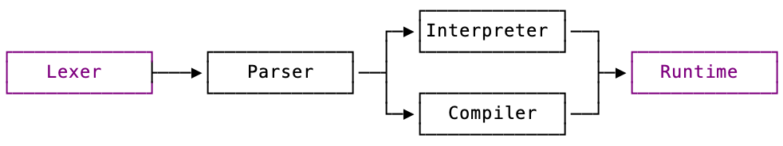

# New Open Source Maintainer Onboarding

New OSM's will be formally onboarded.

In traditional open source a new contributor comes to a project <oven ready> knowing the programming language, development tools and infrastrucuture from some other life.

For this OSM programme the new developer cannot be expected to have any knowledge of these things - and the onboarding reflects that.

## What The Onboarding Will Cover

The scope of this onboarding is:

* stuff you need
    * an Erlang book
    * an APL keyboard
* development tools
    * what we use
    * why we use them
    * how to install them
    * how to use them
* short introduction to Erlang
    * how to learn Erlang
    * what you don't need to learn
        * Pometo is a purely functional project there is no use of:
             * OTP, gen servers
             * message passing/the actor model/concurrency
* introduction to the language toolchain

The onboarding will self-paced with checkpoints.

## Step 1: Read All The Things

You should read the following pages:

* read the [Code Of Conduct](./pometo_contributors_code_of_conduct.md)
* read the [language roadmap](./the_language_roadmap.md)
    * have a play with the Dyalog [live REPL](https://tryapl.org/)
* [our development environment](./our_development_environment.html)
* read about the [development cycle](./the_development_cycle.md)

***Checkpoint***: a discussion with your mentor about what you have learned

## Step 2: Install All The Things

* [the software](./our_development_environment.md)
* [the fonts](./eek_how_do_I_even_type_this.md)

***Checkpoint***: a screen-share with your mentor to make sure everything works well

## Step 3: Play With Erlang

You will have been bought a modern Erlang book. You need to spend a bit of time writing simple Erlang programmes.

There are two aspects to Erlang programming:

* using the basic language
* leveraging the BEAM infrastructure and OTP to build highly-available and concurrent software

`pometo` only requires the first. In Joe Armstrong's book *Programming Erlang* he only devotes 55 pages out of 500 to the basic language. That's all you need. It is small, if slightly unfamiliar.

For this stage you will use an Erlang shell running inside the installed Docker environment that you created for developing `pometo`.

***Checkpoint***: a screenshare with your mentor exploring the language.

If necessary this step can be repeated.

## Step 4: Your First Test

You need to write a simple test like `1 + 2` and then run it.

***Checkpoint***: a screnshare with your mentor

## Step 5: Your First Commit

We have a number of functions are are oven ready and simple to write, including:

* `*` the power function
* `⌈` the maximum and `⌊` the minimum functions
* the relationship functions `<`, `≤`, `=`, `≥`, `>` and `≠`

To implement a function, you:

* write the docs page for it as a work in progress
* raise a PR for that
* get a PR review
* implement the function
   * making sure the function tests past
   * making sure all the other tests past
* create a final PR for approval which
   * adds the WIP docs page to the main docs repo
   * makes it public

There are no checkpoints in this stage - it all happens in the PRs.

## Step 6: Introduction To The Toolchain

***Presentation***: a presentation walking through the toolchain:

* multi-stage lexer
* parser
* interpreter
* compiler
* runtime

The simple getting-started tasks will only involve tiny changes to the lexer and then building functions in the runtime. The parser, interpreter and compiler will just ensure new symbols are mapped to the appropriate function in the runtime.

This presentation will also include bugs, features and other project housekeeping.

## Fly My Pretties, Fly

You are now a fully fledged contributor. There will be weekly meetings with your mentor but most stuff will happen in the repo, the PRs, the code comments, the issues, bugs