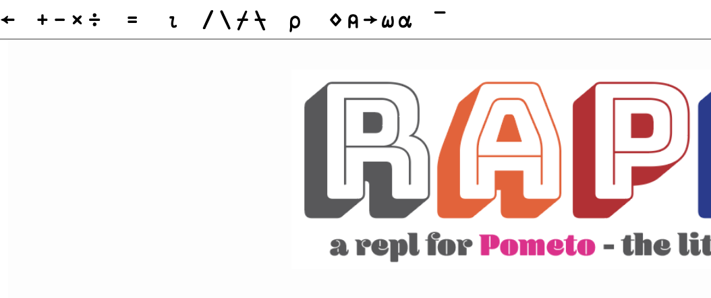
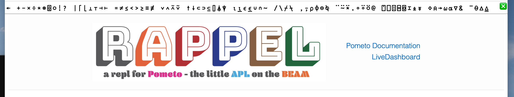
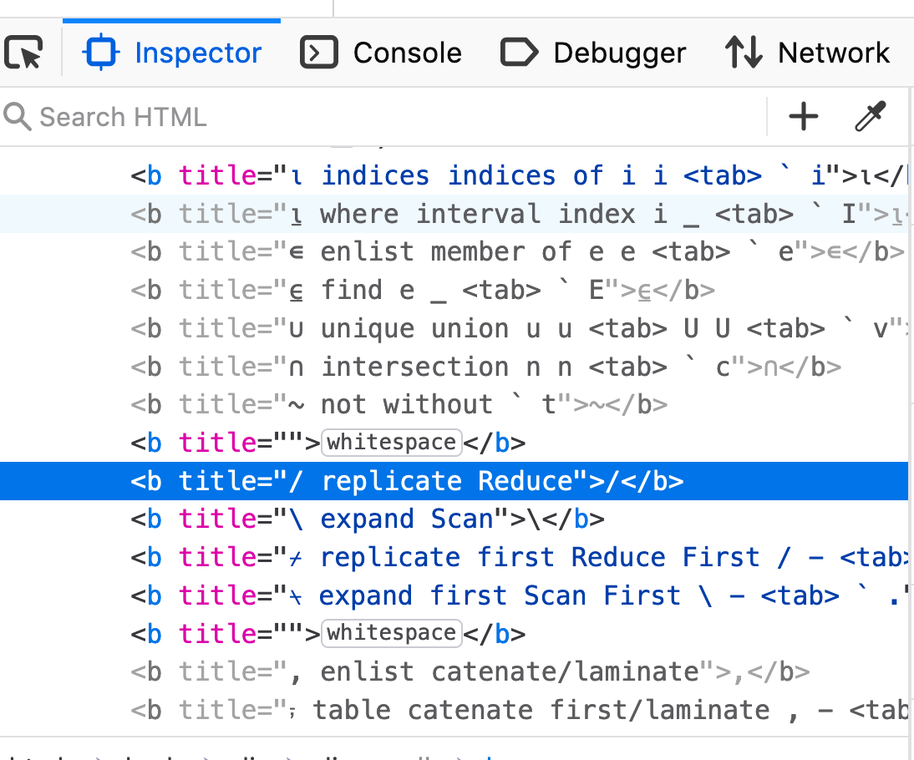

# The REPL (Read-Evaluate-Print-Loop) Rappel

A REPL (read-evaluate-print-loop) is a shell that allows you to build a run fragments of a programming language.

Our REPL is called `rappel` and you can find it here:

[https://github.com/gordonguthrie/rappel/](https://github.com/gordonguthrie/rappel/)

It uses the same development approach as `pometo` - inside docker with scripting for all your tooling and development needs. `pometo` is written in `erlang` but `rappel` is written in `erlang`s sister language `elixir`.

## Enabling New Symbols In Rappel

The REPL needs to be kept in sync with the language. Luckily there is not a lot to do.

The `rappel` REPL has a javascript keyboard to help enter symbols:

There is a full keyboard but most of the symbols are hidden because they are for symbols that have not been implmeneted in `pometo` yet.

First find out what symbol you want to make visible by starting `rappel` and cracking open the web inspector:

Then go into `app.js` for `rappel` and delete the embedded CSS line:

