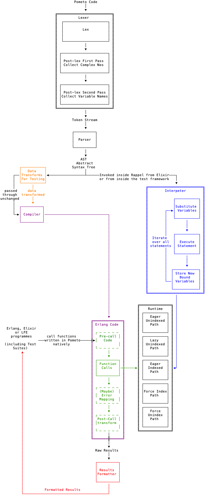

## Toolchain Internals And Testing

Because this project is organised as doc/test-first, the internals of the toolchain are tightly coupled conceptually to the testing infrastructure.

This section is a deep dive into the toolchain to:

* explain its architecture
* explore the rationale behind the design of the testing infrastructure
    * why the 6 different tests are needed

The toolchain appears very complex, but is worth exploring in detail.



The interpreter tests push the source code through the lexer-parser and then run the interpreter embedded in the test framework.

The compiler tests push the source code through and generate a load a `BEAM` file directly into the runtime and then make normal `Erlang` calls to that loaded module.

The compiler output is not fully developed (until we get Named Fns the pre-call code and the post-call can't be written properly. A source map is being built currently but it is not wrapped in the (unwritten) post-call error handling. The purpose of the source map is to translate runtime crash reports from the generated `Erlang` source code to the original `Pometo` source code.

There is a commented out function called `print_src` in `pometo_compiler.erl` and if you uncomment that you can inspect the source code output of the compiler.

One of the modules that is tested by tests generated from this docs page looks like this:

```erlang
-module(how_to_write_docs_pages_as_tests_1_compiler).

-export([run/0]).

-record('$ast¯',
  {do, args = [], line_no = none, char_no = none}).

-record('$shape¯',
  {indexed = false, dimensions = [], forcing = none,
   type = none, line_no = none, char_no = none}).

-record('$func¯',
  {do = false, type = [], construction = primitive,
   result = explicit, shape_changing = false, rank = last,
   line_no = none, char_no = none}).

-record('$op¯',
  {op, fns = [], line_no = none, char_no = none}).

run() ->
    try do_run_11cdad4092f75b9358d539fc59d9f522ca8187eb()
    catch
      E -> io:format("throwing ~p~n", [E]), E
    end.

do_run_11cdad4092f75b9358d539fc59d9f522ca8187eb() ->
    pometo_runtime:dyadic([#'$func¯'{do = ["+"],
             type = dyadic, result = explicit,
             shape_changing = false, rank = none,
             line_no = 1, char_no = 3},
         #'$ast¯'{do =
          #'$shape¯'{indexed = false,
               dimensions = 0,
               forcing = none,
               type = number, line_no = 1,
               char_no = 1},
            args = 1, line_no = 1, char_no = 1},
         #'$ast¯'{do =
          #'$shape¯'{indexed = false,
               dimensions = 0,
               forcing = none,
               type = number, line_no = 1,
               char_no = 5},
            args = 2, line_no = 1, char_no = 5}]).
```

There is already a ***convention*** in 'Erlang'/'Elixir' that `OTP` uses `atom`s that start with `$` and you should generally not do that in your code. We extend that convention here. All `Pometo` runtime `atom`s start with `$` and end with the `apl` negative number symbol `¯` hence `$ast¯`, `$shape¯`, `$var¯`, `$func¯` and `$op¯`. It is not thought that there are many `atom`s out in the wild in existing `Erlang` and `Elixir` codebases that contain this signature `apl` symbol. (Hashtag famous last words, of course.)

There is a different module generated for the 5 non-interpreter tests. In this case 3 of the 5 are identical as making an AST `lazy` or `indexed` is a null op if it doesn't contain arrays (as this test doesn't - operating only on scalars).

In the fullness of time there will be pre-and post-handling code and source map look up around the public function. (Currently the source map is being built but is not integrated - you can inspect it if you poke around the compiler).

There is a build output formatter which will be rolled into the compiler generated post-processing bloc when that is ready - it is shown in red on the diagram.

All tests go through the lexer and parser equally. There are handwritten tests in `test/` that check the basic functionality of the lexer, lexer post-lex passes, interpreter and compiler. The tests generated from docs focus on testing the runtime element of the toolchain.

These tests cast ***shadows*** on the generated test suite - if the lexer tests are failing then the function tests should also fail.

There is also a small set of handwritten tests that check that the output formatter works. If the output formatter is borked then all the generated tests will fail.

These hand-written tests are listed in the batch file `ordered_test.sh`. That determines which failures you should fix first.

The code paths then diverge into interpreter and compiler and the interpreter and compiler tests go through them. Finally when we get to the runtime the invocation of the runtime by the interpreter and compiler is identical. But when we invoke the runtime from within an `Erlang` or `Elixir` programme we start seeing different array representations - `lazy` ones (the parser only emits `eager` and `unindexed` arrays).

By default the executing path is `eager` and `unindexed` and the plain intepreter/compiler tests hit this.

The compiler understands when indexing is needed and will coerce a transformation from an `unindexed` to an `indexed` state. However it is computationally cheaper to hint to a previous `do` on a data struture that it ought to emit a pre-indexed shape and so the `force index` path comes into play. When emitting data back to `Erlang` or `Elixir` it might be a requirement to do so in an unindexed list - and hence the `force unindex` path.

The test suite is thus organised around these paths. For the `lazy`, `indexed`, `force index` and `force unindex` we chose to push the code down the compiler side - that's arbitrary - we could have pushed it down the intepreted side just as easily - the invocation of the runtime is identical in both cases.

We force the `lazy`, `indexed`, `force index` and `force unindex` paths by inserting some transforms between the AST and the compiler. These transforms don't affect the ***syntax*** of the AST - they twiddle the values of fields contained within the `$shape¯` records in the AST that determine the internal data representation and, if necessary, restructure the arguments from simple lists to indexed maps.

This is what a generated test suite looks like - the same inputs and outputs striped across 6 execution paths:

```erlang
%%% DO NOT EDIT this test suite is generated by the pometo_docs_to_test rebar3 plugin

%%% The documentation is usually written Simple -> Complicated
%%% This test suite shows the tests in the reverse of that order.
%%% The first failing test you should fix is the bottom one - the simplest one

-module(getting_started_as_a_developer_of_the_pometo_runtime_and_language_tests).

-include_lib("eunit/include/eunit.hrl").

-compile([export_all]).

how_to_write_docs_pages_as_tests_1_compiler_force_unindex_test_() ->
    Code     = ["1 + 2"],
    Expected = "3",
    Got = pometo_test_helper:run_compiler_force_unindex_test("how_to_write_docs_pages_as_tests_1_compiler_force_unindex", Code),
    % ?debugFmt(" in how_to_write_docs_pages_as_tests_1_compiler_force_unindex(compiler_force_unindex)~nCode:~n~ts~nExp:~n~ts~nGot:~n~ts~n", [Code, Expected, Got]),
    ?_assertEqual(Expected, Got).

how_to_write_docs_pages_as_tests_1_compiler_force_index_test_() ->
    Code     = ["1 + 2"],
    Expected = "3",
    Got = pometo_test_helper:run_compiler_force_index_test("how_to_write_docs_pages_as_tests_1_compiler_force_index", Code),
    % ?debugFmt(" in how_to_write_docs_pages_as_tests_1_compiler_force_index(compiler_force_index)~nCode:~n~ts~nExp:~n~ts~nGot:~n~ts~n", [Code, Expected, Got]),
    ?_assertEqual(Expected, Got).

how_to_write_docs_pages_as_tests_1_compiler_indexed_test_() ->
    Code     = ["1 + 2"],
    Expected = "3",
    Got = pometo_test_helper:run_compiler_indexed_test("how_to_write_docs_pages_as_tests_1_compiler_indexed", Code),
    % ?debugFmt(" in how_to_write_docs_pages_as_tests_1_compiler_indexed(compiler_indexed)~nCode:~n~ts~nExp:~n~ts~nGot:~n~ts~n", [Code, Expected, Got]),
    ?_assertEqual(Expected, Got).

how_to_write_docs_pages_as_tests_1_compiler_lazy_test_() ->
    Code     = ["1 + 2"],
    Expected = "3",
    Got = pometo_test_helper:run_compiler_lazy_test("how_to_write_docs_pages_as_tests_1_compiler_lazy", Code),
    % ?debugFmt(" in how_to_write_docs_pages_as_tests_1_compiler_lazy(compiler_lazy)~nCode:~n~ts~nExp:~n~ts~nGot:~n~ts~n", [Code, Expected, Got]),
    ?_assertEqual(Expected, Got).

how_to_write_docs_pages_as_tests_1_compiler_test_() ->
    Code     = ["1 + 2"],
    Expected = "3",
    Got = pometo_test_helper:run_compiler_test("how_to_write_docs_pages_as_tests_1_compiler", Code),
    % ?debugFmt(" in how_to_write_docs_pages_as_tests_1_compiler(compiler)~nCode:~n~ts~nExp:~n~ts~nGot:~n~ts~n", [Code, Expected, Got]),
    ?_assertEqual(Expected, Got).

how_to_write_docs_pages_as_tests_1_interpreter_test_() ->
    Code     = ["1 + 2"],
    Expected = "3",
    Got = pometo_test_helper:run_interpreter_test(Code),
    % ?debugFmt(" in how_to_write_docs_pages_as_tests_1_interpreter(interpreter)~nCode:~n~ts~nExp:~n~ts~nGot:~n~ts~n", [Code, Expected, Got]),
    ?_assertEqual(Expected, Got).
```

If you screw up your code sections you tests can become wierd and very badly failing for that test module. If the results seem super wacko look at the test source and check it is sane. This can be as simple as a missing backtick or mis-ordered sections.

A cheap and quick way to see if the sets of code and results are correctly done hokey-cokey fashion is to run:

```bash
grep -Rh "\`\`\`" docs/*
```

and inspect the output.
