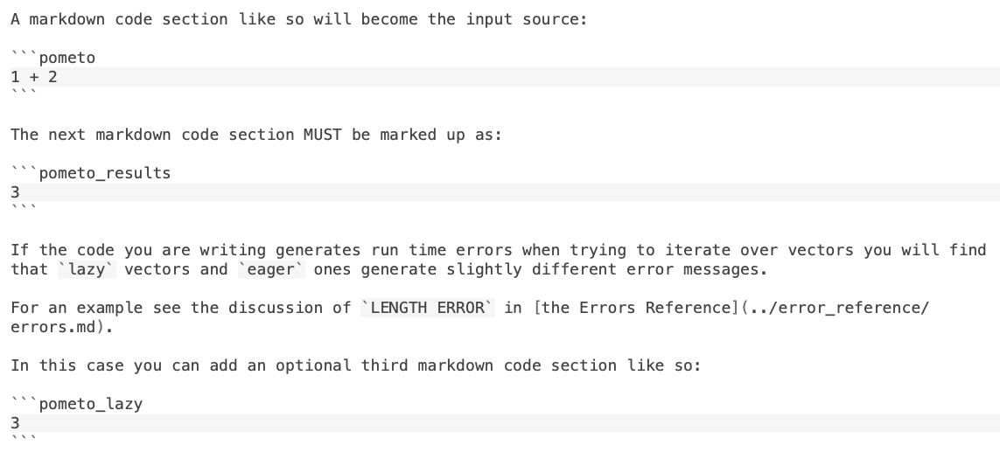

# Getting Started As A Developer Of The Pometo Runtime And Language

## Understanding Pometo

`Pometo` is a reimplementation of a venerable programming language paradigm `apl` (which stands for ***Another Programming Language*** imagine the brass neck of that for a name?).

The aim is to make a janus-faced, pure-functional, auxiliary (or lambda) language:

* looking towards `Erlang`, `Elixir` and `LFE` it is a native `BEAM` language that can handle native data types
* looking towards `apl` it is a ***normal*** `apl` implementation

We therefore have some ***prejudices***:

* conforming to the current version of Dyalog APL (18.0) requires no special decision making
* deviating from or extending the language from that base requires an explicit decision to do so
* `Pometo` is not a concurrent language - it runs inside a single `BEAM` process - concurrency comes from being embedded inside an application writen in `Erlang`, `Elixir` or `LFE`. This means that `Pometo` will ***never*** have what are traditionally thought of as core `BEAM` features:
   * no OTP/supervision trees
   * no message passing
   * no side effects - it is a pure functional language

There are some great Dyalog resources:

* [a manual](https://www.dyalog.com/uploads/documents/MasteringDyalogAPL.pdf)
* [a live `REPL`](https://tryapl.org/)
* [a live help site](http://help.dyalog.com/18.0/index.htm)

## Basic Dev Cycle Of APL Features

The core development cycle is:

* write a documentation page description the operation that you wish to add and the results it should show
  * create your document not in the final directory but in `docs/_work_in_progress`
	* documentation pages are turned into tests - the title of test is the filename - so your docs page should not have the same name as any other page
  * feel free to raise a PR on your new docs page and get a review before starting work on implementing it
* generate the new test suite with the command `BUILDWIP=true rebar3 pometo_docs_to_tests`
    * the `pometo_docs_to_tests` `rebar3` plugin is fairly stable but does occassionally change
    * to fetch and run a new version delete the directory `_build/default/plugins/pometo_docs_to_test` and your next call of any `rebar3` command will fetch and install the latest version
    * the normal usage (without the Environment variable `BUILDWIP`) will build the documents with the `_work_in_progress` directory.
    * you can commit documents pages and have them merged when they are in the `_work_in_progress` directory - think of it as ***booking out*** that feature to work one
* run the tests with `rebar3 eunit`
    * you can run a single test suite with a command like `rebar3 eunit --module=complex_numbers_tests`
* when your code is working and the WIP test suite is passing raise a pull request
    * it should include a `git mv` to move the docs page to its destination
    * it should include changes to `docs/_data/contents.yml` to publish your new documents to the [main docs website](http://gordonguthrie.github.io/pometo)

Code failures in tests are fairly hard to debug because the interpreter and compiler both capture and sanitize runtime errors.

The easiest way to proceed is to copy the input string of the test into the `runner` module and then invoke it with the `run.sh` bash command in `%ROOT`

This runs the same code as a plain Erlang function and you get the full, raw crash report.

There is a pain here - to see debugging output when running test suites you need to use the `?debugFmt` macro (it has the same arguments as `io:format/2` (there is no equivalent to `io:format/1`). It is defined in the eunit include file and added to source code with `-include_lib("eunit/include/eunit.hrl").`

These two output methods don't work with each other `io:format`s don't show when running tests and `?debugFmt`s don't show when running code :-(

This can tend to lead to dirty code with extra `io:format`s and `?debugFmt`s littering the code. Please check your diffs before submitting a PR.

## Basic Dev Cycle For Non-Conformant With Dyalog Features

It is the same basic dev cycle with one pre-step.

Please add a section at the end of the design docs page in the docs directory explaining:

* what you want to do
* why not conforming to Dyalog APL 18.0 is a good idea
* why you want to extend the language or add new features to make it work better with `Erlang`, `Elixir` and `LFE`.

## How To Write Docs Pages As Tests

Docs pages have a simple format.

A markdown code section maked as a `pometo` code block so will become the input source:

```pometo
1 + 2
```

The next markdown code section MUST be marked up as a `pometo_results` code block:

```pometo_results
3
```

If the code you are writing generates run time errors when trying to iterate over vectors you will find that `lazy` vectors and `eager` ones generate slightly different error messages.

For an example see the discussion of `LENGTH ERROR` in [the Errors Reference](../error_reference/errors.md).

***IMPORTANT***: if the output contains quoted strings they must be escaped in the documentation.

In this case you can add an optional third markdown code section marked as `pometo_lazy` code block:

```pometo_lazy
3
```

The source code for this with the code block markings visible looks like:



(in this case the `lazy` and the `eager` evaluation is the same so the contents are the same).

This allows you to give two different results for a given `Pometo` code fragment.

***NOTE***:

* this is only offered for `runtime` `lazy` errors where they cannot be sensibly normalised and should be used rarely. This test suite was 345 tests in before one needed to be written

The `pometo_docs_to_test` `rebar3` plugin will turn this page into a test file `get_started_as_a_developer_tests.erl` in `test/generated_tests` and it will contain a single test `how_to_write_docs_pages_as_tests_1_test_/0`.

It names each test from the second level heading that preceeded it in this case from `##How To Write Docs Pages As Tests` with an incrementing sequence number.

The sequence deliberately increases over the whole document page - this is to ensure there isn't a test name clash if the same sub-heading is used.

You can then run this page with `rebar3 eunit --module=get_started_as_a_developer_tests`.

This is what the generated test looks like. The `pometo` section has been mapped to the code variable. The `pometo_results` section has become the expectation.

Note that six tests have been generated - an interpreted, a compiled, a lazy compiled, an indexed compiled, a force index and a force unindex one. (The interpreted code path is run in [Rappel](https://github.com/gordonguthrie/rappel/) - the `pometo` RAPL.

Essentially data coming in from `Erlang`/`Elixir` will tend to be linked lists and these are represented in `Pometo` as `lazy` vectors - vectors that don't know their size. On the first pass through a traverse they are automatically converted to `eager` vectors - ones that do know their size.

For index operations the internal representation of a vector must be indexed - and again the conversion is handled automatically. The `lazy` and `indexing` test suits just ensure that the code paths can handle that.

`eunit` macros don't play that well with unicode and failures tend to be hard to decipher. To that end a commented out `debugFmt` statement is generated. Uncomment that, re run the tests and voila readable failure reports.

To understand why these 6 tests are needed it is worth examining the lexer, parser, interpreter, compiler and runtime toolchain.


The interpreter tests push the source code through the lexer-parser and then run the interpreter embedded in the test framework.

The compiler tests push the source code through and generate a load a `BEAM` file directly into the runtime and then make normal `Erlang` calls to that loaded module.

The compiler output is not fully developed (until we get Named Fns the pre-call code and the post-call can't be written properly. A source map is being built currently but it is not wrapped in the (unwritten) post-call error handling. The purpose of the source map is to translate runtime crash reports from the generated `Erlang` source code to the original `Pometo` source code.

There is a commented out function called `print_src` in `pometo_compiler.erl` and if you uncomment that you can inspect the source code output of the compiler.

One of the modules that is tested by tests generated from this docs page looks like this:

```erlang
-module(how_to_write_docs_pages_as_tests_1_compiler).

-export([run/0]).

-record('$ast¯',
  {do, args = [], line_no = none, char_no = none}).

-record('$shape¯',
  {indexed = false, dimensions = [], forcing = none,
   type = none, line_no = none, char_no = none}).

-record('$func¯',
  {do = false, type = [], construction = primitive,
   result = explicit, shape_changing = false, rank = last,
   line_no = none, char_no = none}).

-record('$op¯',
  {op, fns = [], line_no = none, char_no = none}).

run() ->
    try do_run_11cdad4092f75b9358d539fc59d9f522ca8187eb()
    catch
      E -> io:format("throwing ~p~n", [E]), E
    end.

do_run_11cdad4092f75b9358d539fc59d9f522ca8187eb() ->
    pometo_runtime:dyadic([#'$func¯'{do = ["+"],
             type = dyadic, result = explicit,
             shape_changing = false, rank = none,
             line_no = 1, char_no = 3},
         #'$ast¯'{do =
          #'$shape¯'{indexed = false,
               dimensions = 0,
               forcing = none,
               type = number, line_no = 1,
               char_no = 1},
            args = 1, line_no = 1, char_no = 1},
         #'$ast¯'{do =
          #'$shape¯'{indexed = false,
               dimensions = 0,
               forcing = none,
               type = number, line_no = 1,
               char_no = 5},
            args = 2, line_no = 1, char_no = 5}]).
```

There is already a ***convention*** in 'Erlang'/'Elixir' that `OPT` uses `atom`s that start with `$` and you should generally not do that in your code. We extend that convention here. All `Pometo` runtime `atom`s start with `$` and end with the `apl` negative number symbol `¯` hence `$ast¯`, `$shape¯`, `$var¯`, `$func¯` and `$op¯`. It is not thought that there are many `atom`s out in the wild in existing `Erlang` and `Elixir` codebases that contain this signature `apl` symbol. (Hashtag famous last words, of course.)

There is a different module generated for the 5 non-interpreter tests. In this case 3 of the 5 are identical as making an AST `lazy` or `indexed` is a null op if it doesn't contain arrays (as this test doesn't - operating only on scalars).

In the fullness of time there will be pre-and post-handling code and source map look up around the public function. (Currently the source map is being built but is not integrated - you can inspect it if you poke around the compiler).

There is a build output formatter which will be rolled into the compiler generated post-processing bloc when that is ready - it is shown in red on the diagram.

All tests go through the lexer and parser equally. There are handwritten tests in `test/` that check the basic functionality of the lexer, lexer post-lex passes, interpreter and compiler. The tests generated from docs focus on testing the runtime element of the toolchain.

These tests cast ***shadows*** on the generated test suite - if the lexer tests are failing then the function tests should also fail.

There is also a small set of handwritten tests that check that the output formatter works. If the output formatter is borked then all the generated tests will fail.

These hand-written tests are listed in the batch file `ordered_test.sh`. That determines which failures you should fix first.

The code paths then diverge into interpreter and compiler and the interpreter and compiler tests go through them. Finally when we get to the runtime the invocation of the runtime by the interpreter and compiler is identical. But when we invoke the runtime from within an `Erlang` or `Elixir` programme we start seeing different array representations - `lazy` ones (the parser only emits `eager` and `unindexed` arrays).

By default the executing path is `eager` and `unindexed` and the plain intepreter/compiler tests hit this.

The compiler understands when indexing is needed and will coerce a transformation from an `unindexed` to an `indexed` state. However it is computationally cheaper to hint to a previous `do` on a data struture that it ought to emit a pre-indexed shape and so the `force index` path comes into play. When emitting data back to `Erlang` or `Elixir` it might be a requirement to do so in an unindexed list - and hence the `force unindex` path.

The test suite is thus organised around these paths. For the `lazy`, `indexed`, `force index` and `force unindex` we chose to push the code down the compiler side - that's arbitrary - we could have pushed it down the intepreted side just as easily - the invocation of the runtime is identical in both cases.

We force the `lazy`, `indexed`, `force index` and `force unindex` paths by inserting some transforms between the AST and the compiler. These transforms don't affect the ***syntax*** of the AST - they twiddle the values of fields contained within the `$shape¯` records in the AST that determine the internal data representation and, if necessary, restructure the arguments from simple lists to indexed maps.

This is what a generated test suite looks like: the same inputs and outputs striped across 6 execution paths:

```erlang
%%% DO NOT EDIT this test suite is generated by the pometo_docs_to_test rebar3 plugin

%%% The documentation is usually written Simple -> Complicated
%%% This test suite shows the tests in the reverse of that order.
%%% The first failing test you should fix is the bottom one - the simplest one

-module(getting_started_as_a_developer_of_the_pometo_runtime_and_language_tests).

-include_lib("eunit/include/eunit.hrl").

-compile([export_all]).

how_to_write_docs_pages_as_tests_1_compiler_force_unindex_test_() ->
    Code     = ["1 + 2"],
    Expected = "3",
    Got = pometo_test_helper:run_compiler_force_unindex_test("how_to_write_docs_pages_as_tests_1_compiler_force_unindex", Code),
    % ?debugFmt(" in how_to_write_docs_pages_as_tests_1_compiler_force_unindex(compiler_force_unindex)~nCode:~n~ts~nExp:~n~ts~nGot:~n~ts~n", [Code, Expected, Got]),
    ?_assertEqual(Expected, Got).

how_to_write_docs_pages_as_tests_1_compiler_force_index_test_() ->
    Code     = ["1 + 2"],
    Expected = "3",
    Got = pometo_test_helper:run_compiler_force_index_test("how_to_write_docs_pages_as_tests_1_compiler_force_index", Code),
    % ?debugFmt(" in how_to_write_docs_pages_as_tests_1_compiler_force_index(compiler_force_index)~nCode:~n~ts~nExp:~n~ts~nGot:~n~ts~n", [Code, Expected, Got]),
    ?_assertEqual(Expected, Got).

how_to_write_docs_pages_as_tests_1_compiler_indexed_test_() ->
    Code     = ["1 + 2"],
    Expected = "3",
    Got = pometo_test_helper:run_compiler_indexed_test("how_to_write_docs_pages_as_tests_1_compiler_indexed", Code),
    % ?debugFmt(" in how_to_write_docs_pages_as_tests_1_compiler_indexed(compiler_indexed)~nCode:~n~ts~nExp:~n~ts~nGot:~n~ts~n", [Code, Expected, Got]),
    ?_assertEqual(Expected, Got).

how_to_write_docs_pages_as_tests_1_compiler_lazy_test_() ->
    Code     = ["1 + 2"],
    Expected = "3",
    Got = pometo_test_helper:run_compiler_lazy_test("how_to_write_docs_pages_as_tests_1_compiler_lazy", Code),
    % ?debugFmt(" in how_to_write_docs_pages_as_tests_1_compiler_lazy(compiler_lazy)~nCode:~n~ts~nExp:~n~ts~nGot:~n~ts~n", [Code, Expected, Got]),
    ?_assertEqual(Expected, Got).

how_to_write_docs_pages_as_tests_1_compiler_test_() ->
    Code     = ["1 + 2"],
    Expected = "3",
    Got = pometo_test_helper:run_compiler_test("how_to_write_docs_pages_as_tests_1_compiler", Code),
    % ?debugFmt(" in how_to_write_docs_pages_as_tests_1_compiler(compiler)~nCode:~n~ts~nExp:~n~ts~nGot:~n~ts~n", [Code, Expected, Got]),
    ?_assertEqual(Expected, Got).

how_to_write_docs_pages_as_tests_1_interpreter_test_() ->
    Code     = ["1 + 2"],
    Expected = "3",
    Got = pometo_test_helper:run_interpreter_test(Code),
    % ?debugFmt(" in how_to_write_docs_pages_as_tests_1_interpreter(interpreter)~nCode:~n~ts~nExp:~n~ts~nGot:~n~ts~n", [Code, Expected, Got]),
    ?_assertEqual(Expected, Got).
```

If you screw up your code sections you tests can become wierd and very badly failing for that test module. If the results seem super wacko look at the test source and check it is same. This can be as simple as a missing backtick or mis-ordered sections.

A cheap and quick way to see if the sets of code and results are correctly done hokey-cokey fashion is to run
```bash
grep -Rh "\`\`\`" docs/*
```

and inspect the output.

***NOTES***:

* sometimes you want to write examples that you don't want to turn into tests, this might be because of duplication or some other reason. You can subsitute `apl` and `apl_results` for `pometo` and `pometo_results` in your text. The code formatter has (will have) the same styles for these
* don't write blank code block is you are just quoting some bollocks give the code block a type of `bollocks` - this makes the `grep` trick usable - a little discipline goes a long way here

Go on, try writing doc tests.

## Adding Documentation

The goal is to build documentation as we go along so any features added to the system need to have associated documentation (and hence tests-generated-from-the-documentation) written as we go along.

Documentation is stored in a structured set of directories under `docs/`. To add a page to the table of contents please edit `docs/_data/contents.yml`. Please follow the basic dev cycle:

* create new docs in the `_work_in_progress` directory.
* write your code until the tests all pass
* raise a PR that includes:
    * migrating the docs page to its final place
    * adding an entry in the `contents.yml` to make sure the docs page appears in the published docs page

Feel free to raise a PR to review a new docs page in the WIP directory befoer starting coding it up.

Please manually check that the documentation builds before you commit your change. (There is one known and unavoidable problem: two left curly brackets side by side is interpreted as a template command and you need to write your `apl` a bit more spaced out - `{ {`.

To build the docs locally start the docker file and `cd /pometo/docs` and run the bash script `./run_jekyll.sh`. This will build the docs and serve them on `0.0.0.0:5000`. They can be accessed on your host machine at `http://localhost:5000`.

You should write your documentation top down - the easy basic and normal cases at the top, errors, edge cases, exceptions futher down.

The test suites are generated in reverse order - so the top example becomes the last test. This means when you make a change a whole lot of tests fail the bottom failure is the test case you should fix first.

## What Happens If A Million Tests Fail?

Don't panic. Tests suites shadow each other. That is to say if a particulary test fails we can predict which other test suites will also fail. Understanding the shadow order helps you decide which of your million failing tests to fix.

The core lexer/parser tests are not generated from docs - run them first.

To do that simply delete all the generated tests (they are not stored in `git` the documentation is the primary source of them) `rm test/generated_tests/*`.

Run `rebar3 eunit` and if there are any failing tests in there fix them. If there is a primitive lexer or parser bug you would expect all tests that use the failing feature to fail also - and therefore this test failure will ***cast its shadow*** onto the feature test suites.

Once the primitive tests are all passing make sure the basic runtime test suite passes. This is described in the documentation page `basics.md`.

To do this first generate the documentation with `rebar3 pometo_docs_to_tests` and then run `rebar3 eunit --module=basics_tests`

This test suite just tests the execution paths of `pometo_runtime` and again a failure here will shadow onto lots of feature tests. Once this test paths you are left with your final feature bugs to fix.

## Rebar Has Crashed!

Ah, are you sure you types `rebar3 ....` and not `rebar ...` becuz `rebar` is also installed as a tool and it doesn't play with `pometo` because of our custom `rebar3` plugin.

## Working On The Runtime

If you are working on the runtime please to add the simplest smoke tests to the documentation page `basics.md`
