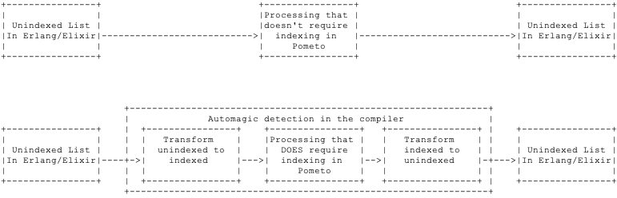

# The stdlib function `⎕make_indexed`

## Indexed and unindexed shapes

A normal `Pometo` shape is an unindexed vector - it is a plain list of arguments:


It is defined by this Erlang record:

```
-record('$shape¯', {
                    shaping    = eager, % [eager | lazy]
                    indexed    = false,
                    dimensions = [],
                    forcing    = none,
                    type       = none,
                    line_no    = none,
                    char_no    = none
                   }).
```

We see that this array `2 2 ⍴ 1 22 333 4444` is represented internally by this data structure:

```erlang
{'$ast¯',{'$shape¯',eager,false,[2,2],none,number,2,16},
                [1,22,333,444],
                2,16}
```

The `stdlib` function `⎕make_indexed` takes one of these and converts it to an indexed vector:

```erlang
{'$ast¯',{'$shape¯',eager,true,[2,2],none,number,2,16},
                 #{1 => 1,2 => 22,3 => 333,4 => 444},
                 2,16}
```

The arguments, which were previously a list are now a map. Notice that the elements are numbered in `ravel` order - a single vector, multi-dimensional indices are then computed from the `dimensions` value for direct look up. This allows reshaping operations to operate on the `dimensions` and not involve rewriting the underlying data representation.

A person writing `Pometo` programmes will never need to know that there are two representations of a shape - but the developer of the `Pometo` runtime does.

The normal use case is someone prepares and distributes data in `Erlang` or `Elixir` consisting off plain lists of data structures. This is converted into a `lazy` and `unindexed` shape in `Pometo`. The first time a `lazy` shape is tranversed it is automatically converted to an `eager` one (the traversal collects the length). The compiler detects when an index look-up is required and tags the appropriate data structure to be indexed whilst being traversed.

The tagging of the data structures takes place in the field `forcing` which can have the values `none | index | unindex`. When the runtime sees a data structure flagged `index` or `unindex` it takes the opportunity of the next traversal to transfrom its internal representation (if it needs it).

Typically the model is



The switch from `lazy` to `eager` and `unindexed` to `indexed` is transparent to the normal `Pometo`, `Erlang` or `Elixir` programmer.

By default the lexer/parser produces unindexed vectors - and for testing we need to be able to make indexed ones. Hence this function.